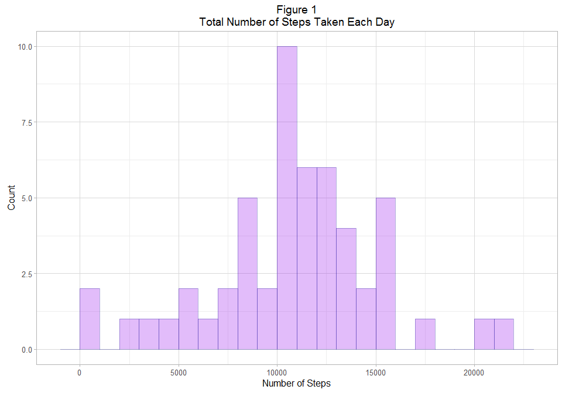
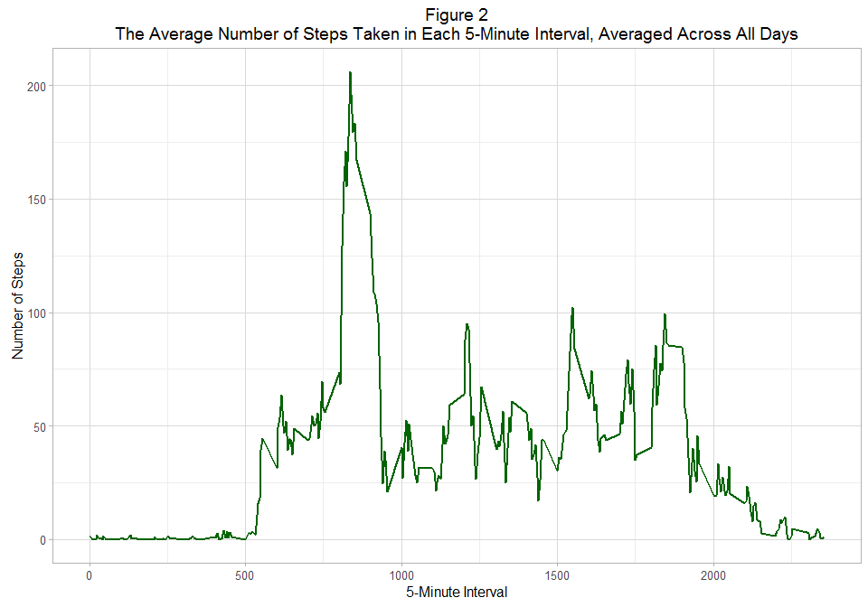
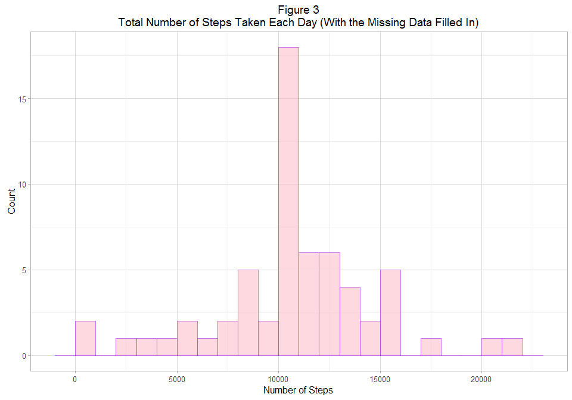
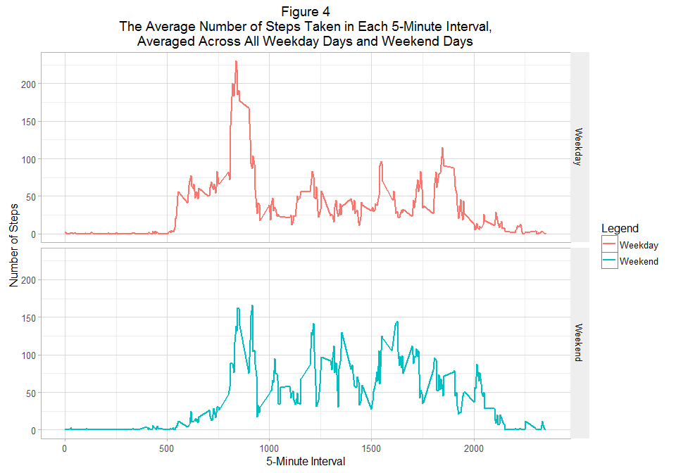

# Reproducible Research: Peer Assessment 1

This assignment makes use of data from a personal activity monitoring device. This device collects data at 5 minute intervals throughout the day. The data consists of two months of data from an anonymous individual collected during the months of October and November, 2012 and include the number of steps taken in 5 minute intervals each day.

The data can be downloaded from the course web site: https://d396qusza40orc.cloudfront.net/repdata%2Fdata%2Factivity.zip

The variables included in this dataset are:

* **steps**: Number of steps taking in a 5-minute interval (missing
    values are coded as `NA`)

* **date**: The date on which the measurement was taken in YYYY-MM-DD
    format

* **interval**: Identifier for the 5-minute interval in which
    measurement was taken
    
The dataset is stored in a comma-separated-value (CSV) file and there
are a total of 17,568 observations in this
dataset.

## Loading and preprocessing the data

The first step of the project is to load data into R and make the necessary transformation of it into a format suitable for further analysis. As the dplyr package is used during the analysis, the data frame is transformed into data frame tbl called `df`.


```r
## Load the data. Then transform the data into data frame tbl 
library(dplyr)
df <-  read.csv(unzip("activity.zip", "activity.csv"))
df <- tbl_df(df)
```

## What is the mean total number of steps taken per day?

The first task is to analyse the total number of steps taken per day ignoring the missing values in the dataset (`df_full`). After converting the tbl `df_full` into a grouped tbl named `df_full_grbydate` by date, another tbl is created (`step_on_day`) to store the total nuber of steps for each day. It is used to create the first histogram of the total number of steps taken each day.


```r
library(ggplot2)
## Ignore the rows with NA, then create a histogram of the total number of 
## steps taken each day
good <- complete.cases(df)
df_full <- df[good, ]
df_full_grbydate <- group_by(df_full, date)
step_on_day <- summarize(df_full_grbydate, steps = sum(steps))
g <- ggplot(step_on_day) + 
    geom_histogram(aes(x = steps), binwidth = 1000, fill = "purple", color = "darkblue", alpha = 0.3) + 
    labs(x = "Number of Steps") +
    labs(y = "Count") + 
    labs(title = "Figure 1\nTotal Number of Steps Taken Each Day") + 
    theme_light()
print(g)
```



The histogram shows that the lowest number of steps taken each day is between 0 and 1000 (as `binwidth = 1000` is set in the code) and the highest number of the daily steps is between 21000 and 22000. The most frequent number of steps a day is between 10000 and 11000, the monitored individual took 10000-11000 number of steps on 10 days during the monitoring.

The next step is to calculate the mean and median of the total number of steps taken a day, ignoring the missing values. These values are stored in variable `mean1` and `median1`.


```r
## Ignoring the missing values (NAs)  calculate and report the mean total 
## number of steps taken per day
mean1 <- mean(step_on_day$steps)
mean1
```

```
## [1] 10766.19
```

```r
## Ignoring the missing values (NAs)  calculate and report the median total 
## number of steps taken per day
median1 <- median(step_on_day$steps)
median1
```

```
## [1] 10765
```

The calculation shows that both the average and the median number of steps taken a day is in the most frequent interval of 10000-11000 steps. The mean is 10766.19, close to the median value of 10765.

## What is the average daily activity pattern?

In order to describe the average daily activity pattern, the average number of steps taken in each of the 5-minute interval, averaged across all days is calculated and stored in variable `step_by_int` after grouping `df_full` by `interval`. Then a time series plot of the 5-minute interval (x-axis) and the average number of steps taken, averaged across all days (y-axis) is created.


```r
## Create a time series plot of the 5-minute interval (x-axis) and the average
## number of steps taken, averaged across all days (y-axis)
df_full_grbyint <- group_by(df_full, interval)
step_by_int <- summarize(df_full_grbyint, steps_int = mean(steps))
g <- ggplot(step_by_int) + 
    geom_line(aes(x = interval, y = steps_int), colour = "darkgreen", size = 1) +
    labs(x = "5-Minute Interval") +
    labs(y = "Number of Steps") + 
    labs(title = 
             "Figure 2\nThe Average Number of Steps Taken in Each 5-Minute Interval, Averaged Across All Days") +
    theme_light()
print(g)
```



The next code chunk finds the 5-minute interval, on average across all the days in the dataset, which contains the maximum number of steps.


```r
## Find the 5-minute interval, on average across all the days in the dataset,
## that contains the maximum number of steps
step_by_int[[which.max(step_by_int$steps_int), 1]]
```

```
## [1] 835
```

The code found that the 5-minute interval during which the monitored individual took the largest number of steps, averaged across all the days, is  between 8.35 A.M. and 8.40 A.M. Figure 2 shows that the individual took more than 200 steps in average within this time interval.

## Imputing missing values

There are a number of days/intervals where there are missing values (coded as `NA`). The presence of missing days may introduce bias into some calculations or summaries of the data. The total number of missing values is counted by the next code chunk.


```r
## Calculate and report the total number of rows with NA in the dataset
nrow(df) - sum(good)
```

```
## [1] 2304
```

As the total number of observations is 175698, and 2304 rows include NA, $2304 / 17568 * 100 = 13\%$ of the data is missing. It is a significant ratio, so imputing may have some effect on the outcome of the analysis.

In this part of the project the missing values are imputed by the mean of their 5-minute interval. Then a new dataset (`df_filled`) is created that is equal to the original dataset but with the missing data filled in.


```r
## Fill in all of the missing values in the dataset with the mean for that
## 5-minute interval
df_filled <- full_join(df, step_by_int, by = "interval")
df_filled <- mutate(df_filled, steps = ifelse(is.na(steps), steps_int, steps))
## Create a new dataset that is equal to the original dataset but with the
## missing data filled in.
df_filled <- select(df_filled, -steps_int)
```

Now the new dataset with the missing data filled in (`df_filled`) is used to create Figure 3, the histogram of the total number of steps taken each day.


```r
## Create a histogram of the total number of steps taken each day
df_filled_grbydate <- group_by(df_filled, date)
step_on_day_filled <- summarize(df_filled_grbydate, steps = sum(steps))
gf <- ggplot(step_on_day_filled) +
    geom_histogram(aes(x = steps), binwidth = 1000, fill = "pink", color = "purple", alpha = 0.6) + 
    labs(x = "Number of Steps") +
    labs(y = "Count") + 
    labs(title = "Figure 3\nTotal Number of Steps Taken Each Day (With the Missing Data Filled In)") + 
    theme_light()
print(gf)
```



Figure 3, the histogram of total daily steps whith the filled-in missing data is similar to Figure 1, the histogram of total daily steps ignoring the missing data. The main difference between the two diagrams is the number of days on which 10000-11000 steps were taken. The mean and median in the first case (when the missing data were ignored) were found within this interval too, so one can conclude that the impute increased the rate of the days with almost average number of steps.

In order to investigate the effect of imputing missing values with the mean of their 5-minute interval, the mean and median total number of steps a day are calculated for the new dataset. The differences between the case of ignored missing values and the case of imputed missing values are also calculated.


```r
## Calculate and report the mean total number of steps taken per day
mean2 <- mean(step_on_day_filled$steps)
mean2
```

```
## [1] 10766.19
```

```r
## Calculate the impact of importing missing data on the mean of the total 
## daily number of stepts
mean2 - mean1
```

```
## [1] 0
```

The average total number of steps a day does not change when we impute the missing values by the average of their 5-minute interval.


```r
## Calculate and report the median total number of steps taken per day
median2 <- median(step_on_day_filled$steps)
median2
```

```
## [1] 10766.19
```

```r
## Calculate the impact of importing missing data on the median of the total 
## daily number of stepts
median2 - median1
```

```
## [1] 1.188679
```

The median of steps a day got closer to the mean after the imputation, the two statistics are essentially equal after the imputation.

## Are there differences in activity patterns between weekdays and weekends?

The analysis continues using the dataset with the filled-in missing values. A new factor variable is created with two levels indicating whether a given date is a weekday day or a weekend day. This dataset is used to demonstrate the difference in the activity pattern between weekdays and weekends by time series plot shown by Figure 4.


```r
## Use the dataset with the filled-in missing values and create a new factor
## variable in the dataset with two levels ("Weekday" and "Weekend") indicating
## whether a given date is a weekday or weekend day.
library(lubridate)
df_filled <- mutate(df_filled, weekday = wday(ymd(as.character(date))))
df_filled <- mutate(df_filled, weekday = as.factor(ifelse(weekday < 2 | weekday > 6, "Weekend", "Weekday")))
df_filled_grbyint <- group_by(df_filled, weekday, interval)
step_by_int_filled <- summarize(df_filled_grbyint, steps_int = mean(steps))
## Create a panel plot containing a time series plot of the 5-minute interval
## (x-axis) and the average number of steps taken, averaged across all weekday
## days or weekend days (y-axis).
gh <- ggplot(step_by_int_filled, aes(color = weekday)) + 
    geom_line(aes(x = interval, y = steps_int), size = 1) + 
    facet_grid(weekday ~ .) +
    labs(x = "5-Minute Interval") +
    labs(y = "Number of Steps") + 
    labs(title = 
             "Figure 4\nThe Average Number of Steps Taken in Each 5-Minute Interval,\nAveraged Across All Weekday Days and Weekend Days") +
    scale_colour_hue(name = "Legend") +
    theme_light() + 
    theme(strip.text.x = element_text(size = 10, colour = "black"),
          strip.text.y = element_text(size = 10, colour = "black"),
          strip.background = element_rect(fill = "#EEEEEE"))
print(gh)
```



The diagram shows that the monitored individual takes less steps early morning (between 5 A.M. and 9 A.M.) on weekend days than on weekdays, in average. It also can be seen, that the individual takes more steps in the afternoon and evening on weekend days than on weekday days. So it seems that the average daily activity pattern shows significant differences between weekday days and weekend days.

